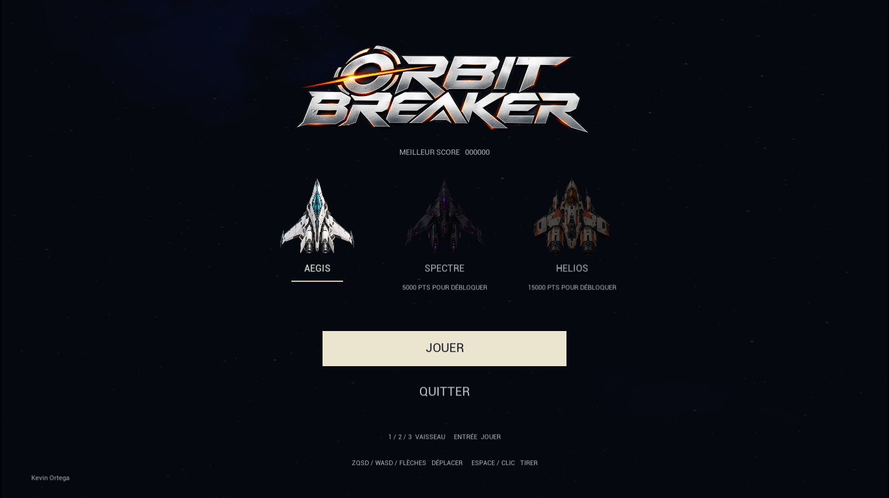
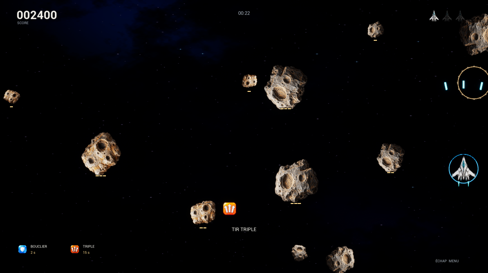
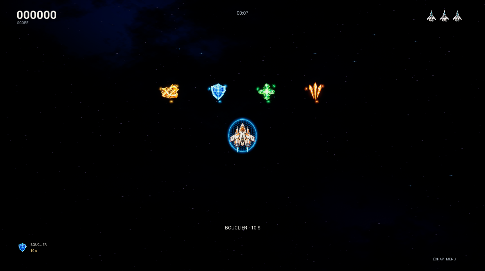

# Orbit Breaker — TP1 Space Shooter

Prototype jouable réalisé avec Unreal Engine 5.8.3. Logique de jeu en C++, paramètres et références des assets dans les Blueprints. Version jouable avec exercices de gestion de versions et vidéo de démonstration.

## Ouvrir et jouer

Ouvrir `SpaceShooter.uproject`, charger `Content/Maps/L_Arena` et lancer Play. Dans le menu, cliquer **Jouer** ou appuyer sur **Entrée**.

- Menu : cliquer sur Aegis, Spectre ou Helios, ou utiliser 1 / 2 / 3 (pavé numérique également). Aegis est disponible dès le départ. Spectre demande un meilleur score de **5 000** en une seule partie, Helios **15 000**. Le record est sauvegardé entre les sessions ; les points de plusieurs parties ne se cumulent pas. Le choix est conservé lors des nouvelles parties. Les trois vaisseaux ont les mêmes performances.
- Flèches, ZQSD ou WASD : déplacement dans les quatre directions.
- Espace ou clic gauche, maintenu : tir avec cadence limitée.
- R : recommencer une partie en cours ou terminée.
- Échap : retour au menu dans le build; dans Play in Editor, le raccourci d'Unreal arrête généralement le test.
- Quitter : bouton du menu principal. Depuis la fin de partie, Retour au menu permet de le retrouver.

Exécutable autonome : `Build/Windows/SpaceShooter.exe`. Le dossier Windows complet est nécessaire; ne pas déplacer uniquement le petit exécutable de lancement.

## Comportement

Les astéroïdes apparaissent sur l'un des quatre bords, à une position et après un délai aléatoires. Une impulsion physique initiale les dirige vers la position du joueur avec une dispersion; ils ne poursuivent pas ensuite le joueur. La catégorie de chaque astéroïde est choisie au hasard une seule fois à sa création. Elle lie la taille, la résistance et les points :

| Catégorie | Échelle | Tirs nécessaires | Points |
|---|---:|---:|---:|
| Petit | 0,55 | 1 | 100 |
| Moyen | 0,95 | 2 | 200 |
| Grand | 1,45 | 3 | 400 |

Les astéroïdes tournent ; leur catégorie ne change pas lorsqu’ils sont touchés par un laser. Une barre segmentée sous chaque astéroïde indique les coups restants.

Deux grands qui entrent en collision sont remplacés par **exactement trois moyens** ; deux moyens par **trois petits**, avec un effet de débris et un son de roche original. Les deux parents disparaissent. Les petites tailles ou les tailles différentes ne se fragmentent pas. Les nouveaux fragments disposent de 0,8 seconde de protection contre la fragmentation pour éviter une cascade immédiate. Ces collisions ne donnent pas de points ; les fragments détruits au laser donnent ensuite les points de leur catégorie.

Seul le tir qui détruit l’astéroïde rapporte les points de sa catégorie, une seule fois. Un contact retire une vie et consomme l'astéroïde. Une protection de 1,5 seconde évite de perdre plusieurs vies immédiatement; le vaisseau clignote pendant cette récupération. Une collision durant cette protection consomme aussi l'astéroïde, sans score. À zéro vie, les apparitions et le score s'arrêtent et le bilan propose de rejouer ou de revenir au menu.

La difficulté augmente progressivement avec la vitesse des astéroïdes (plafond +50 % après 90 secondes). Leur nombre est limité et ceux sortis de la zone sont supprimés. Le redémarrage nettoie astéroïdes, projectiles et effets puis réinitialise score, vies et durée ; il nettoie également les bonus présents et leurs effets temporaires, tout en conservant le record.

### Bonus

Le premier bonus peut apparaître après 8 secondes, puis un délai aléatoire de 12 à 18 secondes sépare les tentatives. Au plus deux bonus restent présents en même temps, pendant 12 secondes chacun. Ils clignotent avant de disparaître et se collectent au contact du vaisseau.

| Bonus | Effet | Probabilité par apparition |
|---|---|---:|
| Doré ×2 | Double les points pendant 15 s | Environ 31,67 % |
| Bouclier bleu | Protège pendant **10 s**, avec anneau autour du vaisseau | Environ 31,67 % |
| Réparation verte | Rend **une vie**, maximum trois | **5 %** |
| Tir triple orange | Trois lasers simultanés, gauche/centre/droite, pendant 15 s | Environ 31,67 % |

Les types peuvent se combiner. Reprendre un bonus renouvelle sa durée sans cumuler plusieurs multiplicateurs. Les secondes restantes sont affichées en bas à gauche.

## Architecture et réglages

| C++ | Blueprint | Responsabilité et valeurs utiles |
|---|---|---|
| ShipPawn | BP_Ship | Entrées, mouvement, limites, cadence, projectile, effets et trois matériaux de vaisseau |
| ShotProjectile | BP_Projectile | Mouvement balayé, impact unique, vitesse et durée de vie |
| SpaceAsteroid | BP_Asteroid | Trois catégories : taille, résistance et points liés; impulsion physique, rotation, deux textures de roche et fragmentation |
| SpaceGameMode | BP_SpaceGameMode | Menu/partie/fin, record sauvegardé, déblocages, bonus, score et vies ; apparitions, musiques et sons des boutons |
| CombatBurst | BP_MuzzleFlash / BP_AsteroidBurst / BP_RockCollision | Fragments animés, anneau de collision, durée, couleur et sons |
| SpaceHUD | BP_OrbitHUD | Interface Canvas sobre, choix et verrouillage des vaisseaux, vies, HP et bonus actifs |
| SpacePickup | BP_BonusDoubleScore / BP_BonusShield / BP_BonusRepair / BP_BonusTripleShot | Collecte unique, sprite, type, son et durée de présence |

L’interface est dessinée en C++ avec mise à l’échelle : menu centré sans panneaux décoratifs, trois vaisseaux dont les choix verrouillés sont assombris, score et vies discrets en partie. Le vaisseau en jeu est réduit à 68 % de sa taille précédente, avec collision adaptée. Elle utilise Canvas, sans Designer UMG. Les Blueprint enfants règlent les valeurs et références d’assets ; les Event Graphs ne contiennent pas la logique du jeu. Le sujet demande explicitement C++ pour le fonctionnement et Blueprint pour l’ajustement/paramétrage. Guide pratique : [Blueprints et réglages](Docs/Blueprints_et_reglages.md).

## Assets originaux

Les trois nouveaux vaisseaux **Aegis**, **Spectre** et **Helios**, ainsi que l’emblème de score, sont des PNG transparents détaillés créés pour le projet avec l’outil intégré imagegen. Les sources et les prompts complets sont dans `ArtSources/Fleet/Generation.md`. Ce sont des sprites prérendus appliqués sur un plan en jeu, et non des modèles 3D volumétriques. Les matériaux, textures et le plan sont dans `Content/Art/Fleet` ; `Tools/import_fleet_art.py` réalise leur import et configure les Blueprints. Les mêmes images servent aux portraits du menu et aux vies.

Les astéroïdes actuels utilisent **deux nouveaux sprites rocheux transparents** générés pour le projet, sans cristaux ni facettes géométriques artificielles. Sources et prompts : `ArtSources/Arcade/Generation.md` ; import : `Tools/import_arcade_content.py`.

Le logo **Orbit Breaker** argent/orange remplace le titre texte du menu. Les quatre bonus sont des symboles détourés sans tuile de fond : ×2 doré, bouclier bleu, cristal de réparation vert et trois lasers orange. Sources PNG RGBA originales et prompts imagegen : [ArtSources/Effects/Generation.md](ArtSources/Effects/Generation.md). Ils flottent avec des particules orbitales et déclenchent une onde colorée à la collecte. Le bouclier est une enveloppe électrique animée, avec cellules hexagonales discrètes, apparition progressive, impulsion d’impact et disparition en fin de protection. Les matériaux et animations sont natifs à Unreal, configurés par les Blueprints.

L’ancien flash de tir composé de cubes provoquait un rectangle noir devant le vaisseau. Il est remplacé par un éclat additif transparent ; les composants de fragments démarrent également avec une taille minimale avant leur initialisation. Un test visuel dédié compare les trois vaisseaux avant et pendant le tir pour détecter toute nouvelle disparition de pixels.

La correction couvre aussi les astéroïdes : textures avec alpha complet, laser additif et explosions de poussière/étincelles sans primitives opaques. Un second test visuel contrôle qu’une destruction proche ne noircit pas le rocher survivant. Le logo du menu flotte doucement et s’incline légèrement. Le laser joue aléatoirement l’un de trois nouveaux sons à impulsion, plus courts et graves, synthétisés sans échantillon externe : [sources audio](ArtSources/Effects/LaserAudio.md).

Le son de collision (0,95 s), le son de collecte (0,38 s) et l’anneau de débris sont originaux. Les sons sont synthétisés par `Tools/generate_arcade_audio.py`. La nébuleuse et les anciens sons proviennent des outils procéduraux du projet ; sa luminosité est réduite par un nouveau matériau. Les anciens meshes et l’emblème restent dans les sources historiques mais ne composent plus le décor ou le HUD actuel. Les polices et primitives de base proviennent d’Unreal. Aucun pack supplémentaire n’est nécessaire pour jouer. Les nouvelles compositions orchestrales utilisent les samples CC0 de Versilian Studios / Sam Gossner (VSCO 2 CE), dont la licence, les références et les empreintes sont conservées dans ArtSources/Soundtrack.

Références de lisibilité étudiées : [Super Stardust HD](https://housemarque.com/games/sshd) et [Nova Drift](https://store.steampowered.com/app/858210/Nova_Drift/). Aucun asset de ces jeux n’a été copié.

Avant de relancer un outil de génération, faire Check Out sur ses assets existants. Pour reconstruire les assets depuis leurs sources, exécuter dans l’ordre le contenu historique, l’import de flotte, l’import arcade, l’import des effets puis `Tools/import_combat_polish.py`, après `Tools/generate_laser_audio.py`, et enfin **`Tools/import_soundtrack.py`**, après `Tools/generate_soundtrack.py`. Les scripts précédents rétablissent l’apparence de leurs jalons.

Les deux musiques ont été entièrement recomposées dans une direction **orchestrale cinématique** : **Quiet Orbit**, 50,5 s à 76 BPM, avec cordes et cors ; **Breaker Run**, 60 s à 128 BPM, avec ostinatos, cuivres et percussions épiques. Elles se fondent entre menu et partie ; le bilan retrouve la musique du menu. Rejouer en cours de partie ne coupe pas la boucle. Quatre clics courts et feutrés remplacent les anciennes petites mélodies des boutons : survol, sélection, validation et retour, également au clavier. Sources, composition et réglages : [bande-son originale](ArtSources/Soundtrack/Composition.md).

Les plugins Geometry Scripting, EditorToolset et MCP servent uniquement à l'éditeur et sont exclus de la cible du jeu. MCP peut être démarré avec `ModelContextProtocol.StartServer 8000`; adresse locale `http://127.0.0.1:8000/mcp`. Il ne démarre pas automatiquement dans le build Windows.

## Validation — 30 septembre 2026

- Compilation Editor et packaging Windows Shipping réussis.
- Quatre tests de gameplay, deux tests visuels, un test des transitions audio et l’enregistrement de démonstration passent : **8 réussites, 0 échec, 0 avertissement de test**. Rapport local : `Artifacts/OrchestralValidation/index.json`.
- Audio : deux SoundWave en boucle et quatre confirmations non bouclées ; passage menu/partie/bilan, relance et inversions rapides de fondu vérifiés, sans lecteur restant actif après sa sortie.
- Combat : commandes de tir, cadence, impact unique, expiration, projectiles rapides, résistances 1/2/3 et scores 100/200/400.
- Commandes et partie : déplacements, limites, apparitions aléatoires, impulsion physique, collisions, protection après dégâts, fin, redémarrage et retour au menu.
- Nouveaux systèmes : collisions physiques de deux grands en trois moyens et de deux moyens en trois petits, catégories différentes exclues, aucun score de collision, grâce des fragments et effet créé.
- Bonus : collecte réelle une seule fois, ×2 puis retour au score normal, bouclier puis reprise des dégâts, réparation plafonnée, trois trajectoires simultanées et retour au tir simple après expiration.
- Progression : seuils 4 999 / 5 000 et 14 999 / 15 000, refus du vaisseau verrouillé, record non cumulé entre parties, sauvegarde sur disque et rechargement dans un slot temporaire distinct de celui du joueur.
- Menu et jeu inspectés sur les captures réelles : logo animé, bonus détourés avec particules, bouclier électrique à cellules hexagonales, rochers, HP et tirs triples. Le test du tir mesure au plus 0,2 % de pixels lumineux noircis sur les trois vaisseaux (seuil : 5 %). Pour les deux effets d’astéroïde vérifiés près d’un rocher survivant, la mesure est de 0,0 % (seuil : 1 %), contre jusqu’à 2,4 % avec les anciens fragments opaques.
- Build Windows lancé et menu/partie vérifiés ; les vérifications complètes des mécaniques sont réalisées dans l’éditeur.
- Build complet : **372280675 octets**, soit **372,28 Mo**, sous 500 Mo. Les 26 fichiers du build sont comparés par empreinte avec la sortie du packaging avant intégration dans Perforce main.

## Gestion de versions et remise

Le dossier de travail `SpaceShooter` correspond au stream Perforce `//20263_8PRO135_KEVIN_ORTEGA/dev`, workspace `kortega_tp1_dev_DESKTOP_6NT64UN`. Le serveur est `ssl:p4prod.uqac.ca:1666`, utilisateur `kortega`. Avant de modifier un fichier suivi, faire Check Out; les assets utilisent le type exclusif `binary+l`. Les caches, rapports et paramètres de connexion restent exclus. Le dossier `Build/Windows` est versionné dans Perforce et ignoré dans Git.

Les branches Git locales `main` et `dev` existent. Git et Perforce ont des historiques distincts. Ne pas changer de branche Git au milieu de modifications Perforce. Le premier envoi Perforce est 5801 sur main, le peuplement de dev 5803, et le jalon tir/destruction 5847 sur dev.

Les conflits volontaires Git et Perforce sont réalisés et expliqués dans `Docs/Conflits_revision_control.md`, avec les sorties brutes des deux outils. Le commit de fusion Git conserve ses deux parents; Perforce contient les changements 5901 à 5905. Le jeu et le build ont été intégrés sur main dans Perforce (5902), puis le build reconstruit et les preuves de remise dans 5913. Les branches Git locales main et dev contiennent aussi la version jouable et les preuves.

`Files/PerforceCommits.png` est une capture réelle de P4V montrant les changements main/dev et la résolution.

`Files/VideoDemoJeux.mp4` contient environ 59 secondes de capture réelle dans Unreal : menu verrouillé, Aegis, déplacements, tirs et nouvelles mécaniques. L’outil Editor `SpaceShooter.Delivery.RecordDemo`, exclu du build, simule les commandes du joueur. Quatre collectes et une paire d’astéroïdes sont mises en scène pour montrer les ajouts ; les autres apparitions suivent les règles normales. Il n’accorde aucun déblocage à la vraie sauvegarde. Les images du viewport sont assemblées selon leurs horodatages. La vidéo inclut le mix audio réel du jeu (musiques et effets), capturé sur le master submix Unreal, sans son du bureau ni microphone. La capture hors écran active temporairement l’audio de l’éditeur en arrière-plan (sans modifier les préférences enregistrées) pour éviter le silence lorsque la fenêtre n’a pas le focus. `Tools/assemble_demo.py` refuse un fichier audio silencieux, écrêté ou de durée incohérente avant assemblage. Les sources de capture temporaires restent dans Saved, ignoré par Git et Perforce.

Dépôt GitHub public : https://github.com/overgamefr06-debug/TP1-SpaceShooter-OrbitBreaker

Les branches `main` et `dev` sont publiées avec leur historique complet, dont le commit de fusion `88f1ef1` qui résout le conflit volontaire. `Files/GithubCommits.png` est une capture réelle de l'historique GitHub. Les trois fichiers demandés (`GithubCommits.png`, `PerforceCommits.png`, `VideoDemoJeux.mp4`) sont réunis dans `Files` sur le stream main de Perforce, à côté de `Build/Windows`.

Les fichiers générés, les paramètres de connexion locaux, les notes et les transcriptions des cours restent hors du dépôt public. Le build est conservé dans Perforce et ignoré par Git. Les traces de tests locales restent dans `Artifacts`.

Avant de remettre ou présenter le travail, rejouer une partie et relire `Docs/Conflits_revision_control.md` ainsi que les classes C++ pour pouvoir expliquer les choix techniques.

Audit détaillé de chaque ligne du barème et étapes administratives restantes : [Docs/Audit_TP1.md](Docs/Audit_TP1.md). La date de remise du PDF et les éventuelles modalités Moodle restent à confirmer ; la présence des fichiers dans les dépôts ne prouve pas une remise administrative.
